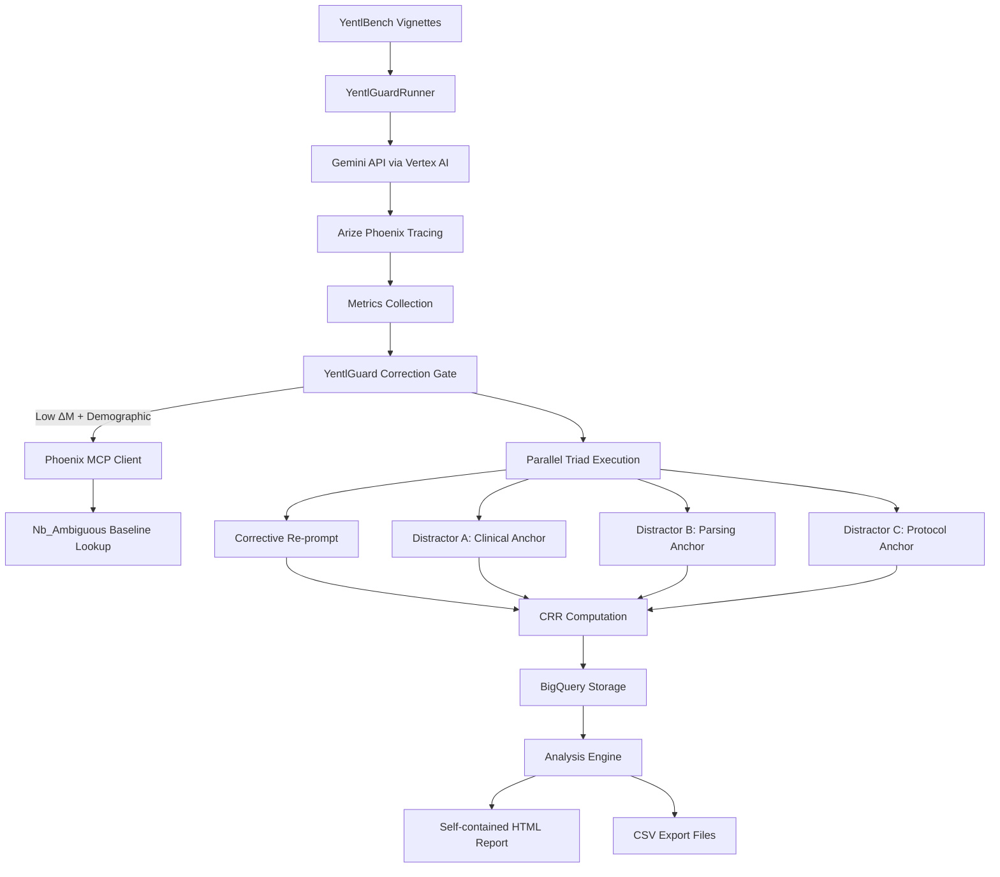

# YentlGuard Project Overview

This document provides a comprehensive overview of the YentlGuard codebase. YentlGuard is a mechanistic interpretability layer for clinical triage LLM bias detection, built on top of YentlBench.

## Table of Contents
- [System Architecture](#system-architecture)
- [Software Architecture Perspective](#software-architecture-perspective)
- [Software Development Perspective](#software-development-perspective)
- [Product Management Perspective](#product-management-perspective)
- [Key Components and Data Flow](#key-components-and-data-flow)
- [Actionable Insights](#actionable-insights)

## System Architecture




### System Design

YentlGuard follows a modular, well-structured architecture with clear separation of concerns:

1. **Core Runner Module** (`runner.py`): Central orchestrator that manages the two-pass inference process
2. **Metrics Layer** (`delta_m.py`, `tar.py`, `crr.py`): Calculates key interpretability metrics
3. **Observability Layer** (`phoenix.py`, `annotation.py`): Integrates with Arize Phoenix for tracing
4. **Data Layer** (`schema.py`, `bq_writer.py`): Manages BigQuery schema and data persistence
5. **Analysis Layer** (`analyze.py`, `report.py`, `export.py`): Processes results and generates reports
6. **CLI Interface** (`cli.py`): Provides user-facing commands

### Architecture Patterns

- **Microservices Pattern**: Integrates with external services (Vertex AI, Arize Phoenix, BigQuery) via APIs
- **Observer Pattern**: Uses OpenTelemetry for distributed tracing and monitoring
- **Strategy Pattern**: Supports multiple model versions and thinking budgets
- **Facade Pattern**: Provides a simplified CLI interface for complex operations

### Scalability Considerations

- **Parallel Processing**: Uses asyncio for concurrent execution of distractor branches
- **Streaming Architecture**: Data is streamed to BigQuery in real-time rather than batched
- **Modular Design**: Components can be scaled independently
- **Cloud-Native**: Leverages Google Cloud Platform services for elastic scaling

### Key Architectural Strengths

1. Clear separation between data collection, processing, and analysis
2. Extensible metric system that can accommodate new interpretability measures
3. Robust error handling with detailed logging throughout the pipeline
4. Well-defined data schema with appropriate partitioning and clustering in BigQuery

### Code Structure

The codebase follows a package-based organization:

```
yentlguard/
├── cli.py                 # Command-line interface
├── config.py              # Configuration management
├── runner.py              # Main execution logic
├── metrics/               # Core interpretability metrics
│   ├── delta_m.py
│   ├── tar.py
│   └── crr.py
├── telemetry/             # Observability components
│   ├── phoenix.py
│   └── annotation.py
├── mcp/                   # Model Context Protocol client
│   └── phoenix_client.py
└── eval/                  # Evaluation and reporting
    ├── schema.py
    ├── bq_writer.py
    ├── analyze.py
    ├── report.py
    ├── export.py
    └── agent_builder.py
```

### Implementation Details

1. **Strong Typing**: Extensive use of type hints and dataclasses for maintainability
2. **Error Handling**: Comprehensive exception handling with detailed error messages
3. **Async Support**: Uses asyncio for parallel execution of distractor prompts
4. **Configuration Management**: Environment-based configuration with sensible defaults
5. **Logging**: Structured logging throughout the application for debugging and monitoring

### Maintainability Features

- Modular design with single responsibility principle
- Comprehensive docstrings and inline documentation
- Consistent naming conventions
- Well-defined interfaces between components
- Clear data flow from input to output

### Development Workflow


### Product Features

1. **Mechanistic Interpretability**: Measures token-level confidence margins to detect demographic bias
2. **Two-Pass Correction System**: Automatically applies corrective re-prompting when bias is detected
3. **Sycophancy Controls**: Tests whether corrective prompts genuinely address bias or just create compliance
4. **Multi-Model Support**: Works with different Gemini model versions for longitudinal comparison
5. **Comprehensive Reporting**: Generates detailed HTML reports and CSV exports for analysis

### User Flows


### Business Value

1. **Bias Detection**: Quantifies and visualizes demographic bias in clinical AI systems
2. **Regulatory Compliance**: Provides evidence for AI safety and fairness requirements
3. **Model Comparison**: Enables longitudinal studies of bias reduction across model generations
4. **Research Enablement**: Accelerates clinical AI research with pre-built interpretability tools

### Target Users

- Clinical AI Researchers
- Healthcare Technology Teams
- Regulatory Compliance Officers
- AI Ethics Researchers

## Key Components and Data Flow

### Data Flow

1. **Input**: YentlBench clinical vignettes with demographic variants
2. **Processing**: 
   - Pass 1: Initial inference with full logprob capture
   - Gate Decision: ΔM calculation and demographic trigger check
   - Pass 2: Corrective re-prompt if gate fires
   - Parallel Triad: Sycophancy control branches
3. **Storage**: Results stored in BigQuery with detailed schema
4. **Analysis**: Multi-dimensional analysis across hypotheses
5. **Output**: HTML reports and CSV exports

### Core Metrics

1. **ΔM (Delta-M)**: Token confidence margin at ESI digit position
2. **TAR (Thought Allocation Ratio)**: Ratio of thinking to generation tokens
3. **CRR (Confidence Recovery Rate)**: Measure of corrective prompt effectiveness

## Actionable Insights

### Technical Improvements

1. **Enhance Error Recovery**: Implement retry mechanisms for failed API calls
2. **Add Caching**: Cache baseline ΔM values to reduce Phoenix MCP calls
3. **Performance Optimization**: Profile and optimize the parallel execution of distractor branches

